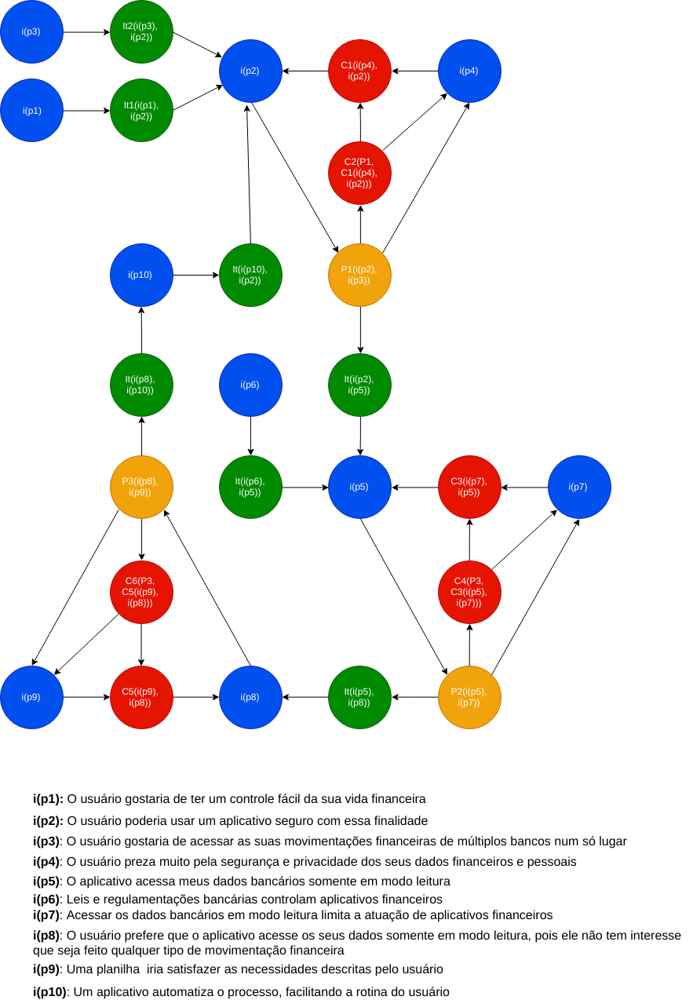
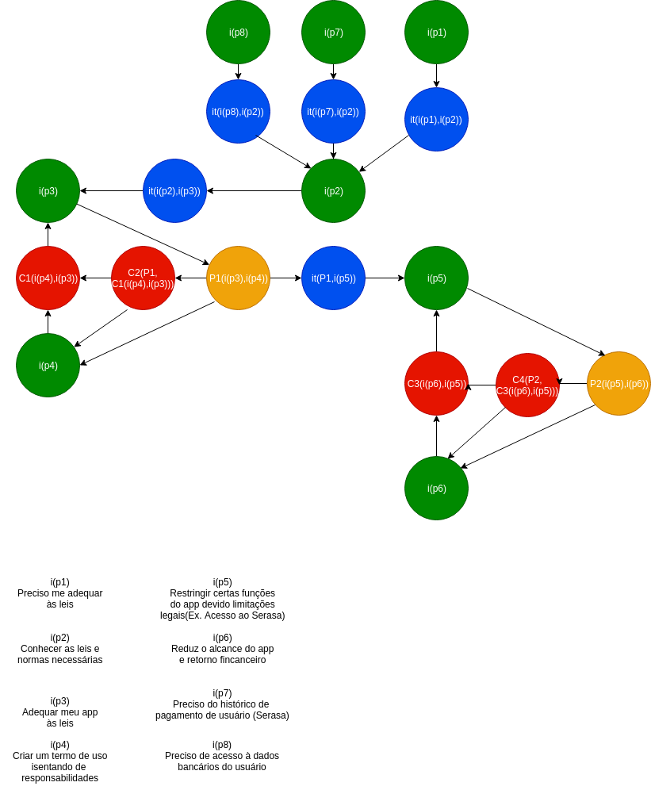

 
## Introdução

A argumentação é uma técnica usada na pré-rastreabilidade de Requisitos de Software e tem como objetivo principal ajudar na resolução de conflitos entre vários argumentos. Aqui serão exibidas a evolução das argumentações, desde os rascunhos até a as versões melhoradas.

## ARG01 - Usuário de aplicativos financeiros

Esta argumentação simula uma pessoa que pretende usar um aplicativo para gerenciar suas despesas pessoais, e os entraves no processo.

Rascunho:

A partir do rascunho foi possível montar a argumentação de maneira organizada:

## ARG02 - Instituições reguladoras e Leis

Esta argumentação simula as preocupações de um aplicativo com as leis e normas de instituições reguladoras.

## Referências

- [LEI Nº 13.709, DE 14 DE AGOSTO DE 2018](http://www.planalto.gov.br/ccivil_03/_Ato2015-2018/2018/Lei/L13709.htm). 

- [Banco Central do Brasil](https://www.bcb.gov.br/)