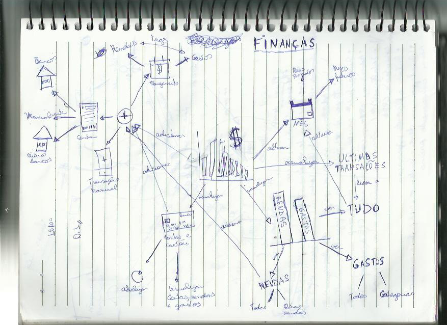
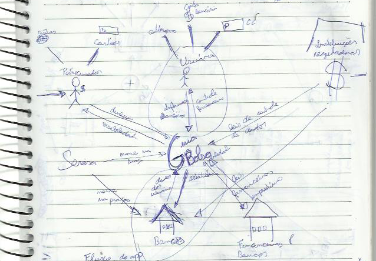
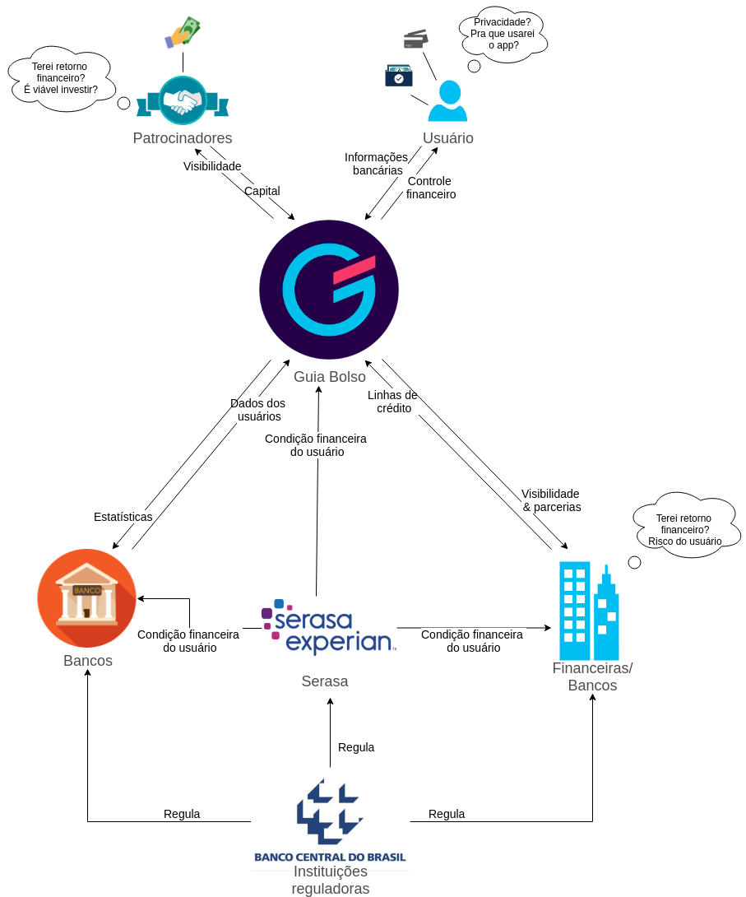

## Introdução

Os RichPictures são artefatos usados na fase de pré-rastreabilidade de Requisitos de Software, são desenhos que expressam ideias que ajudam na representação de subsistemas de um sistema maior. 

## RP00 - Richpictures Macro e Aba Financeiro (Guiabolso)

Estes richpictures foram os primeiros rascunhos, ilustrando uma tentativa de entender o funcionamento do aplicativo num contexto macro e micro (Financeiro). 

Rascunhos:

A partir do rascunho e das sugestões feitas pelos professores foi elaborado um novo richpicture, dessa vez digital e com o foco somente no macro:

